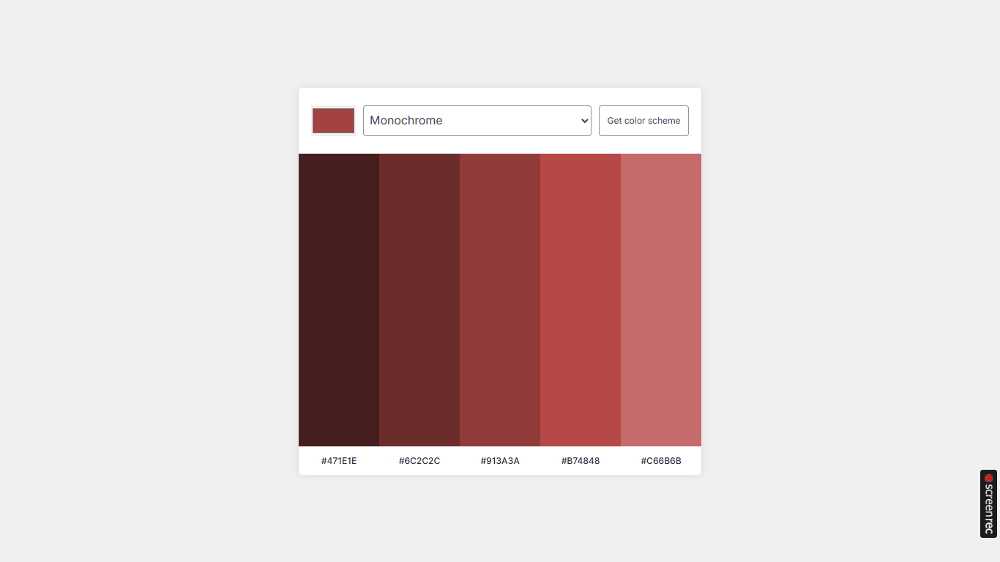

# 🎨 Color Picker App (Using Color API)

A simple and interactive **Color Picker Web App** that allows users to select colors and fetch detailed color information using a public Color API.

---

## 🌐 Live Demo

Check out the live version of the app here: [Color Picker Live App](https://tanv404.github.io/Color-Picker/)

--- 

## 🚀 Features

- 🎯 Pick any color using a color input
- 🌈 Fetch color details from API
- 📊 Displays:
  - HEX value
  - RGB value
  - HSL value
  - Color name
- ⚡ Fast and responsive UI
- 💡 Beginner-friendly project

---

## 🛠️ Tech Stack

- **Frontend:** HTML, CSS, JavaScript  
- **API:** [The Color API](https://www.thecolorapi.com/)

---

## 📂 Project Structure

color-picker/
├── index.html
├── style.css
├── script.js
├── README.md
└── screenshots/
    ├── ColorPicker.png

---

## ⚙️ How It Works

1. User selects a color using the color picker.
2. The selected HEX value is sent to the Color API.
3. API returns detailed color data.
4. Data is displayed on the screen dynamically.

---

## Screenshots
 
